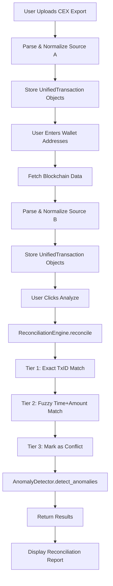

# Analysis Logic Documentation

**Document Created:** 2026-01-27  
**Version:** 1.0  
**Last Updated:** 2026-01-27 17:03 EST

---

## Objective

The reconciliation system compares two transaction data sources to identify matches, conflicts, and discrepancies:
- **Source A (CEX Export):** Transaction data from CoinLedger export (CSV/MHTML)
- **Source B (Blockchain):** On-chain transaction data fetched from Bitcoin blockchain via Blockstream API

**Goal:** Ensure all CEX-reported transactions are accurately reflected on the blockchain and identify any discrepancies for tax reporting accuracy.

---

## System Flow



---

## Data Model: UnifiedTransaction

All transactions from both sources are normalized into a common format:

```python
@dataclass
class UnifiedTransaction:
    timestamp: datetime      # Transaction date/time (UTC)
    asset: str              # Cryptocurrency symbol (e.g., 'BTC')
    amount: float           # Net amount (positive = deposit, negative = withdrawal)
    fee: float              # Transaction fee
    tx_id: str              # Blockchain transaction ID
    tx_type: str            # Type: Deposit, Withdrawal, Trade, etc.
    source: str             # 'CEX' or 'BLOCKCHAIN'
    price_krw: Optional[float]  # Price in KRW (optional)
```

---

## Reconciliation Logic

### Phase 1: Data Preparation

1. **Source A Processing:**
   - Parse CSV/MHTML file
   - Use AI (Gemini) to infer column mappings
   - Fallback to manual mapping if AI fails
   - Handle special formats (e.g., Xverse wallet exports)
   - Convert to `UnifiedTransaction` objects

2. **Source B Processing:**
   - Fetch transactions from Blockstream API for each wallet address
   - Support pagination to get complete history
   - Calculate net amount per transaction (outputs - inputs)
   - Determine transaction type (Deposit/Withdrawal/Internal)
   - Convert to `UnifiedTransaction` objects

### Phase 2: Matching Algorithm

The reconciliation engine uses a **3-tier matching strategy**:

#### **Tier 1: Exact Transaction ID Match**
- **Criteria:** `source_a.tx_id == source_b.tx_id`
- **Confidence:** 1.0 (100%)
- **Match Type:** `EXACT_TXID`
- **Logic:**
  ```python
  if row_a['tx_id'] and row_a['tx_id'] == row_b['tx_id']:
      # Perfect match found
      mark_as_matched(confidence=1.0)
  ```

#### **Tier 2: Fuzzy Time + Amount Match**
- **Criteria:** 
  - Time window: ±30 minutes from Source A timestamp
  - Amount deviation: ≤0.1% difference
- **Confidence:** 0.9 - 1.0 (based on deviation)
- **Match Type:** `FUZZY_TIME_AMOUNT`
- **Logic:**
  ```python
  time_window = timedelta(minutes=30)
  candidates = source_b.filter(
      timestamp between (row_a.timestamp - 30min, row_a.timestamp + 30min)
  )
  
  for candidate in candidates:
      deviation = abs(row_a.amount - candidate.amount) / row_a.amount
      if deviation <= 0.001:  # 0.1%
          confidence = 1.0 - (deviation * 100)
          if confidence >= 0.9:
              mark_as_matched(confidence)
  ```

#### **Tier 3: Unmatched / Conflict**
- **Criteria:** No match found in Tier 1 or Tier 2
- **Issue:** `MISSING_IN_BLOCKCHAIN`
- **Action:** Mark as conflict for manual review
- **Logic:**
  ```python
  if not matched:
      conflicts.append({
          'source_a': row_a,
          'source_b': None,
          'issue': 'MISSING_IN_BLOCKCHAIN'
      })
  ```

### Phase 3: Identify Missing Transactions

After matching, identify transactions present in Source B but not matched to Source A:

```python
missing_in_a = source_b_transactions - matched_transactions
```

These represent blockchain transactions not reported in the CEX export.

---

## Current Limitations & Future Enhancements

### Current Limitations:
1. **No Semantic Matching:** Tier 3 doesn't use AI to understand transaction context
2. **Single Asset Only:** Currently optimized for Bitcoin only
3. **Time Window Fixed:** 30-minute window may miss some valid matches
4. **No Fee Reconciliation:** Fees are not compared during matching
5. **No Multi-Hop Detection:** Complex transactions (e.g., swaps) not handled

### Planned Enhancements:
1. **Tier 3 Gemini Semantic Match:**
   - Use AI to analyze transaction descriptions
   - Match based on context and patterns
   - Handle complex transaction types

2. **Configurable Matching Parameters:**
   - User-adjustable time window
   - Customizable amount deviation threshold
   - Asset-specific matching rules

3. **Multi-Asset Support:**
   - Extend to Ethereum, other chains
   - Handle token transfers
   - Support DEX transactions

4. **Advanced Anomaly Detection:**
   - Detect wash trading patterns
   - Identify suspicious timing
   - Flag unusual fee amounts

---

## Anomaly Detection

After reconciliation, the `AnomalyDetector` scans all transactions for suspicious patterns:

### Detection Rules:
1. **Duplicate Transactions:** Same amount, asset, and timestamp
2. **Unusual Timing:** Transactions at odd hours or rapid succession
3. **Fee Anomalies:** Fees significantly higher/lower than normal
4. **Amount Patterns:** Round numbers or suspicious patterns

---

## Output Format

### Matched Transactions
```json
{
  "source_a": { /* UnifiedTransaction from CEX */ },
  "source_b": { /* UnifiedTransaction from Blockchain */ },
  "confidence": 0.95,
  "match_type": "FUZZY_TIME_AMOUNT"
}
```

### Conflicts
```json
{
  "source_a": { /* UnifiedTransaction from CEX */ },
  "source_b": null,
  "issue": "MISSING_IN_BLOCKCHAIN"
}
```

### Missing in A (Present in Blockchain only)
```json
{
  "timestamp": "2025-01-15T10:30:00Z",
  "asset": "BTC",
  "amount": 0.001,
  "tx_id": "abc123...",
  /* ... other fields */
}
```

---

## Performance Considerations

- **Time Complexity:** O(n × m) where n = Source A size, m = Source B size
- **Optimization:** Early exit on exact TxID match reduces average case
- **Memory:** All transactions loaded into memory (acceptable for typical use cases)
- **API Rate Limits:** Blockstream API has no strict limits but recommend delays between requests

---

## Testing & Validation

### Test Cases:
1. ✅ Exact TxID match
2. ✅ Fuzzy time+amount match within 30 minutes
3. ✅ Amount deviation within 0.1%
4. ✅ Missing transactions in blockchain
5. ✅ Multiple wallet addresses
6. ✅ Date range filtering

### Known Edge Cases:
- **Scientific Notation:** Handled in CSV parser
- **Empty Amounts:** Skipped during normalization
- **Multiple Currencies:** Separated by asset type
- **Unconfirmed Transactions:** Timestamp set to current time

---

## Version History

### v1.0 (2026-01-27)
- Initial documentation
- 3-tier matching system
- Bitcoin blockchain support
- Multi-wallet support
- Date range filtering
