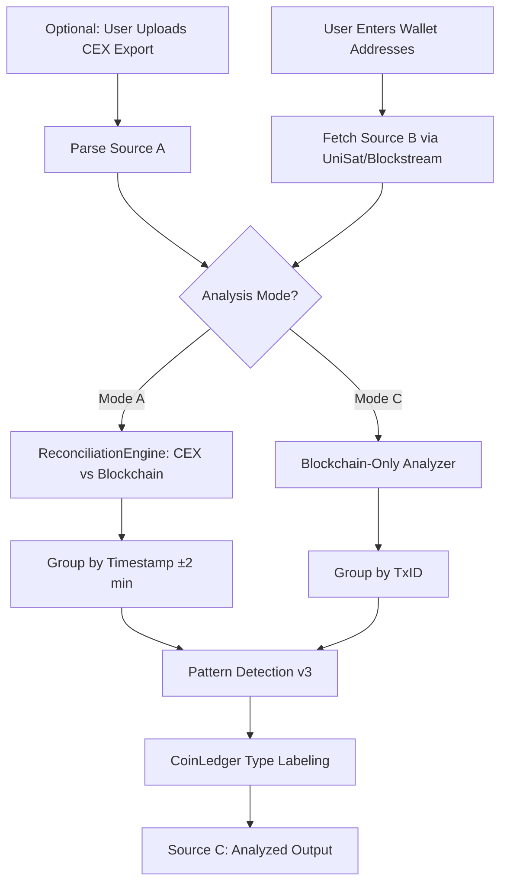

# Bitcoin Transaction Analysis Logic v3.0

**Merged from:** `ANALYSIS_LOGIC.md` + `Bitcoin Transaction Anlysis logic.md`  
**Last Updated:** 2026-02-18

---

## Objective

Analyze Bitcoin transactions from blockchain data (and optionally CEX exports) to correctly classify them for CoinLedger tax reporting. The system identifies complex patterns that CoinLedger commonly misclassifies.

### Two Analysis Modes

| Mode | Inputs | Description |
|------|--------|-------------|
| **Mode A: CEX + Blockchain** | Source A (CEX CSV) + Source B (Blockchain) | Cross-reference CEX records against on-chain reality |
| **Mode C: Blockchain-Only** | Source B (Blockchain) only | Analyze on-chain patterns without CEX data |

---

## System Flow

---

## Pattern Detection v3 (Priority Order)

### Tier 1: Platform-Specific (Magic Eden)

| # | Pattern | On-Chain Fingerprint | Detection Logic | CoinLedger Type |
|---|---------|---------------------|-----------------|-----------------|
| P1 | **Magic Eden Buy** | Sender=`bc1q`, Output to `bc1p` + 2% fee output | An output equals exactly `0.02 × seller_amount` (±10 sats tolerance) | **Trade** (Buy) |
| P2 | **Magic Eden Sale** | Input from `bc1p`, large BTC deposit to `bc1q` | Incoming BTC with asset outflow from Taproot address | **Trade** (Sell) |
| P3 | **ME Batch Transfer** | 1000 sats tracking fee output | Any output with exactly `1000 sats (0.00001 BTC)` | **Transfer** |

### Tier 2: Protocol-Specific (Runes & Ordinals)

| # | Pattern | On-Chain Fingerprint | Detection Logic | CoinLedger Type |
|---|---------|---------------------|-----------------|-----------------|
| P4 | **Runes Mint/Etch** | OP_RETURN with Runestone data | `OP_RETURN OP_PUSHNUM_13` in scriptPubKey ASM | **Trade** (Mint) |
| P5 | **Rune Receive** | Deposit with Rune metadata | UniSat API returns rune_name for the txid | **Deposit** (non-taxable) |
| P6 | **Cenotaph (Burn)** | Malformed Runestone | Cenotaph flag in OP_RETURN data | **Investment Loss** |
| P7 | **BRC-20 Transfer** | Witness contains `{"p":"brc-20"}` | JSON in witness data with `op: transfer` | **Trade** |

### Tier 3: General Bitcoin Patterns

| # | Pattern | On-Chain Fingerprint | Detection Logic | CoinLedger Type |
|---|---------|---------------------|-----------------|-----------------|
| P8 | **Bulk Mint** | 1 Withdrawal + N Dust Deposits | Withdrawal + multiple outputs ≤ 10,000 sats to `bc1p` | **Mint** (Cost) + N **Ignored** (Dust) |
| P9 | **Mint/Buy** | 1 Withdrawal + 1 Dust Deposit | Withdrawal + single output ≤ 546 sats | **Mint** (Cost) + **Ignored** (Dust) |
| P10 | **Self Transfer** | Withdrawal + Deposit (same amount) | Both addresses belong to user's wallet set | **Ignored** |
| P11 | **Gas Fee** | Small Withdrawal (<50k sats) | No matching deposit, amount < threshold | **Withdrawal** (Fee) |
| P12 | **Sale** | Large Deposit (no withdrawal) | Incoming BTC without corresponding outflow | **Trade** (Sell) |
| P13 | **Fiat On-Ramp** | CEX deposit, no blockchain tx | CEX record with no matching on-chain tx | **Trade** (Buy) |

---

## Address Role Separation

Bitcoin wallets (Xverse, UniSat) use distinct address types:

| Address Type | Prefix | Role | Tax Implication |
|-------------|--------|------|-----------------|
| Payment | `bc1q...` | BTC spending/receiving | Cost basis tracking |
| Taproot | `bc1p...` | Ordinals/Runes storage | Asset acquisition |
| Legacy | `1...`, `3...` | Older BTC transactions | Standard tracking |

> **Key Rule:** `bc1q` → `bc1p` flow within same user = **Asset Purchase** (NOT Self-Transfer)

---

## CoinLedger Type Mapping

Per `COINLEDGER_UNIVERSAL_IMPORT_GUIDELINE.md`:

| Pattern | CoinLedger Type | Asset Sent | Asset Received |
|---------|----------------|------------|----------------|
| Magic Eden Buy | Trade | BTC (total spent) | [Asset Name] |
| Magic Eden Sale | Trade | [Asset Name] | BTC (received) |
| Runes Mint | Trade | BTC (fees) | [Rune Name] (qty) |
| Rune Receive | Deposit | — | [Rune Name] |
| Self Transfer | Ignored | — | — |
| Gas Fee / Network Fee | Withdrawal | BTC (fee amount) | — |
| Sale of Asset | Trade | [Asset Name] | BTC (proceeds) |
| Fiat On-Ramp | Trade | USD (if known) | BTC |
| Dust (546 sats) | Ignored | — | — |

### CSV Format Rules
- **Date:** `mm/dd/yyyy hh:mm:ss` (UTC only)
- **No currency symbols** in amount columns
- **Empty cells** for N/A (not `0` or `N/A`)
- **Trade:** Both Sent + Received filled → Type field optional
- **Deposit/Withdrawal:** Type field **mandatory**

---

## Verification Links

For each transaction, generate verification links to:
- **Mempool.space:** `https://mempool.space/tx/{txid}`
- **Blockchain.com:** `https://www.blockchain.com/btc/tx/{txid}`
- **Ordiscan:** `https://ordiscan.com/tx/{txid}`
- **OKLink:** `https://www.oklink.com/btc/tx/{txid}`

---

## API Sources

| API | Purpose | Used For |
|-----|---------|----------|
| **UniSat API** | Primary blockchain data | Rune/Ordinal metadata, transaction fetching |
| **Blockstream API** | Fallback/basic BTC data | Standard transaction structure |
| **Mempool.space** | Transaction verification | OP_RETURN data, fee analysis |
| **CoinGecko** | Price data | USD conversion |
