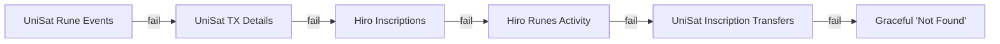

# API & Environment Variables Specification

> CoinLedger Parser — External API and Configuration Reference  
> Last Updated: 2026-02-19

---

## Table of Contents
1. [Environment Variables (.env)](#environment-variables)
2. [External APIs](#external-apis)
3. [Internal API Endpoints](#internal-api-endpoints)
4. [API Fallback Chain](#api-fallback-chain)

---

## Environment Variables

| Variable | Required | Purpose | Where to Get |
|----------|----------|---------|-------------|
| `DEPLOYMENT_TIER` | ✅ | Sets `production` or `development` mode | Set manually |
| `GEMINI_API_KEY` | Optional | Google Gemini AI for CSV schema inference | [Google AI Studio](https://aistudio.google.com/apikey) |
| `UNISAT_API_KEY` | ✅ | Primary API for Rune/Ordinal metadata lookup | [UniSat Developer](https://developer.unisat.io/) |
| `HIRO_API_KEY` | Optional | Fallback API for Rune/Ordinal verification | [Hiro Platform](https://platform.hiro.so/settings/api-keys) |
| `QUICKNODE_RPC_URL` | Optional | Bitcoin RPC fallback (Blockstream is primary) | [QuickNode](https://www.quicknode.com/) |
| `COINGECKO_API_KEY` | Optional | BTC/USD price data (avoids rate limits) | [CoinGecko](https://www.coingecko.com/en/api/pricing) |
| `GOOGLE_APPLICATION_CREDENTIALS` | Optional | Service account JSON for Google Sheets export | [Google Cloud Console](https://developers.google.com/sheets/api/quickstart/python) |

### Variable Details

#### `GEMINI_API_KEY`
- **Why:** Auto-maps non-standard CSV column headers to the expected schema during file upload
- **Used in step:** **Step 1 — Upload** (`src/ingest/csv_parser.py` → `infer_schema_with_gemini()`)
- **NOT used in:** Step 3 Options A, B, or C (imported in `engine.py` but marked as "Future Implementation")
- **Model:** `gemini-2.0-flash`
- **Is it required?** **No.** For standard CoinLedger (Source A) and Xverse (Source B) CSV/JSON exports, the manual fallback header matching works fine. Only needed if you upload CSVs from other wallets/exchanges with unusual column names.

#### `UNISAT_API_KEY`
- **Why:** Primary source for Rune names, amounts, divisibility, and Ordinal inscription data
- **Used in:**
  - `src/api/server.py` → `/api/fetch-rune-info` endpoint (3 UniSat calls)
  - `src/reporting/sheets_exporter.py` → `fetch_rune_info()`, `fetch_inscription_info()`
  - `frontend/src/utils/apiClient.ts` → `fetchOrdinalInfo()`, `fetchRuneInfo()`
- **Auth header:** `Authorization: Bearer {UNISAT_API_KEY}`
- **Rate limit:** Plan-dependent (free tier ~3 req/sec)

#### `HIRO_API_KEY`
- **Why:** Fallback when UniSat fails or returns no data
- **Used in:**
  - `src/api/server.py` → `/api/fetch-rune-info` fallback #2
  - `frontend/src/utils/apiClient.ts` → `fetchOrdinalInfo()`, `fetchRuneInfo()` fallbacks
- **Auth header:** `x-hiro-api-key: {HIRO_API_KEY}`
- **Rate limit:** 900 requests/minute

> [!WARNING]
> **Hiro is sunsetting service by March 2026.** Plan to migrate fallback to another provider before then.

#### `QUICKNODE_RPC_URL`
- **Why:** Optional Bitcoin RPC node for raw transaction data (Blockstream free API is primary)
- **Used in:** `src/reconciliation/blockchain.py` → `BlockchainClient.__init__()`
- **Note:** Only used if Blockstream API fails or is rate-limited

#### `COINGECKO_API_KEY`
- **Why:** Fetches real-time BTC/USD price for USD toggle display
- **Used in:** `frontend/src/App.tsx` → `fetchBtcPrice()`
- **Note:** Works without key but may hit rate limits on free tier

#### `GOOGLE_APPLICATION_CREDENTIALS`
- **Why:** Service account credentials for Google Sheets export (Option B)
- **Used in:** `src/reporting/sheets_exporter.py` → `GoogleSheetsExporter.__init__()`

---

## External APIs

### 1. Blockstream API (No Key Required)
| Detail | Value |
|--------|-------|
| **Base URL** | `https://blockstream.info/api` |
| **Purpose** | Fetch raw Bitcoin transaction history for wallet addresses |
| **Rate limit** | ~10 req/sec (free, no key needed) |
| **Used in** | `src/reconciliation/blockchain.py` → `BlockchainClient.fetch_transactions()` |

**Endpoints used:**
```
GET /address/{address}/txs              # Fetch transactions for address
GET /address/{address}/txs/chain/{txid} # Paginated fetch (after last seen tx)
```

**Why needed:** Core data source — fetches all on-chain transaction history (`vin`/`vout`, timestamps, fees, witness data) for the user's Bitcoin addresses.

---

### 2. UniSat API (Key Required) — PRIMARY
| Detail | Value |
|--------|-------|
| **Base URL** | `https://open-api.unisat.io/v1/indexer` |
| **Purpose** | Rune & Ordinal metadata (names, amounts, inscriptions) |
| **Rate limit** | Plan-dependent |
| **Auth** | `Authorization: Bearer {UNISAT_API_KEY}` |

**Endpoints used:**

| Endpoint | Purpose | Called from |
|----------|---------|------------|
| `GET /runes/event?cursor=0&size=20&txid={txid}` | Rune transfer events for a tx | `server.py` → `fetch_rune_info()` |
| `GET /tx/{txid}` | General tx details (fallback) | `server.py` → `fetch_rune_info()` |
| `GET /tx/{txid}/inscription-transfers` | Inscription transfers in a tx | `server.py` → fallback #3 |
| `GET /inscription/info/{inscriptionId}` | Inscription metadata | `apiClient.ts` → `fetchOrdinalInfo()` |
| `GET /runes/tx/{txid}/balances` | Rune balances for a tx | `apiClient.ts` → `fetchRuneInfo()` |

**Why needed:** Only reliable source for decoded Rune names (vs raw hex placeholders like `RUNE_a4b40e86`). Also provides Ordinal inscription numbers, content types, and transfer details.

---

### 3. Hiro API (Key Optional) — FALLBACK
| Detail | Value |
|--------|-------|
| **Base URL** | `https://api.hiro.so` |
| **Purpose** | Fallback for Rune/Ordinal data when UniSat fails |
| **Rate limit** | 900 requests/minute |
| **Auth** | `x-hiro-api-key: {HIRO_API_KEY}` |
| **Status** | ⚠️ **Sunsetting March 2026** |

**Endpoints used:**

| Endpoint | Purpose | Called from |
|----------|---------|------------|
| `GET /ordinals/v1/inscriptions?output={txid}:0` | Inscriptions in a tx output | `server.py` → fallback #2 |
| `GET /ordinals/v1/inscriptions/{inscriptionId}` | Inscription metadata | `apiClient.ts` → `fetchOrdinalInfo()` |
| `GET /runes/v1/transactions/{txid}/activity` | Rune activity for a tx | `server.py` + `apiClient.ts` → fallbacks |

**Why needed:** Provides redundancy when UniSat is down or rate-limited. Returns inscription numbers, content types, rune names, and amounts in a different format.

---

### 4. Mempool.space (No Key Required)
| Detail | Value |
|--------|-------|
| **Base URL** | `https://mempool.space` |
| **Purpose** | Transaction verification links for user-facing UI |
| **Rate limit** | Generous (link-only, no API calls) |

**Usage:**
```
https://mempool.space/tx/{txid}
```

**Used in:**
- `ReviewPanelA.tsx` — "View on Mempool" link in expanded cards
- `CorrectionReport.tsx` — Verification links on correction actions
- `ordinals_detector.py` — `mempool_link` field in pattern results

**Why needed:** User-facing verification — users click to confirm transaction details on a trusted Bitcoin explorer.

---

### 5. Ordiscan (No Key Required)
| Detail | Value |
|--------|-------|
| **Base URL** | `https://ordiscan.com` |
| **Purpose** | Ordinal/inscription verification links |
| **Rate limit** | Link-only |

**Usage:**
```
https://ordiscan.com/tx/{txid}
```

**Used in:** `ordinals_detector.py` → `get_ordiscan_link()`, `get_rune_links()`

**Why needed:** Best UI for visually verifying Ordinal inscriptions and their content.

---

### 6. CoinGecko API (Key Optional)
| Detail | Value |
|--------|-------|
| **Base URL** | `https://api.coingecko.com/api/v3` |
| **Purpose** | Real-time BTC/USD price for the USD toggle |
| **Rate limit** | 10-30 req/min (free), higher with key |

**Endpoint used:**
```
GET /simple/price?ids=bitcoin&vs_currencies=usd
```

**Used in:** `frontend/src/App.tsx` → `fetchBtcPrice()` (on mount)

**Why needed:** Powers the USD toggle that shows dollar amounts next to BTC values in Review Panels A and B.

---

## Internal API Endpoints

The backend (`src/api/server.py`) exposes these endpoints at `http://localhost:8000`:

| Method | Path | Purpose |
|--------|------|---------|
| `POST` | `/api/upload` | Upload Source A (CoinLedger CSV) or Source B (Xverse JSON/CSV) |
| `POST` | `/api/analyze` | Run Option C analysis (reconciliation + pattern detection) |
| `POST` | `/api/fetch-blockchain` | Fetch blockchain tx history for given addresses |
| `POST` | `/api/fetch-rune-info` | On-demand Rune/Ordinal lookup (UniSat → Hiro → UniSat Inscriptions) |
| `POST` | `/api/export-sheets` | Export results to Google Sheets |
| `GET`  | `/api/health` | Health check |

---

## API Fallback Chain

### Rune/Ordinal Fetch (`/api/fetch-rune-info`)



### Frontend API Client (`apiClient.ts`)

**Ordinals:** UniSat → Hiro  
**Runes:** UniSat → Hiro → Metadata fallback

Rate-limited APIs are temporarily blocked for 60 seconds before retry.
